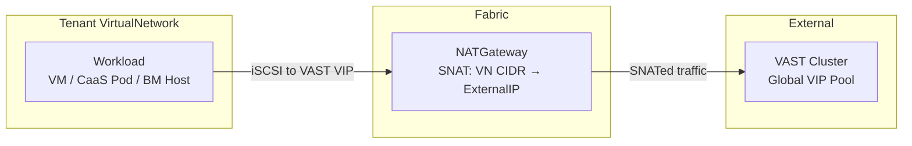

# Storage Networking for Dev Preview (0.4)

## Summary

Provide network connectivity from OSAC tenant workloads (VMaaS, CaaS, BMaaS)
to the external VAST block storage cluster using SNAT via the existing
NATGateway primitive. Introduce a platform-level Storage VIP CIDR reservation
that prevents tenant VirtualNetwork CIDRs from overlapping with VAST VIP
addresses, ensuring storage-bound traffic always routes externally rather than
being trapped in the fabric. See [PRD](prd.md) for detailed requirements.

## Motivation

The storage subsystem (OSAC-1332, OSAC-1111) assumes "CaaS cluster nodes have
network reachability to the storage backend" without defining how that
reachability is achieved. Tenant workloads run inside isolated VirtualNetworks
on the OSAC fabric. The VAST cluster runs outside the datacenter. Without an
explicit networking path, three problems arise:

1. **No route to storage.** Tenant VirtualNetworks are fabric-isolated. Traffic
   destined for VAST VIPs has no defined exit path.

2. **Silent IP overlap.** If a tenant's VN CIDR overlaps with the VAST VIP
   range, the fabric routes those packets internally instead of externally.
   Storage access fails with no clear error.

3. **NAT capacity.** Block storage generates concurrent iSCSI sessions and CSI
   operations through the NATGateway. There is no validation that the NAT pool
   supports this load.

The approach proposed here — treating VAST as an external service consumed via
SNAT — is the simplest viable path for the 0.4 dev preview timeframe. It
reuses existing networking primitives (VirtualNetwork, NATGateway, ExternalIP)
and avoids per-tenant VLAN configuration on the VAST side. Storage tenant
isolation is not required for Dev Preview.

### Goals

- Reuse existing networking primitives (NATGateway, ExternalIP, NetworkClass).
  No new CRDs or controllers for storage networking.
- Enforce Storage VIP CIDR reservation via validation in the fulfillment-service,
  preventing VirtualNetwork CIDR overlap at creation time.
- Ensure the default tenant onboarding flow produces a storage-ready network
  configuration (NATGateway with external connectivity to VAST).
- Support all three consumer types: VMaaS (automatic via CSI), CaaS (automatic
  via CSI), and BMaaS (network path only, manual storage configuration).

### Non-Goals

- Per-tenant VAST VIP pools or storage tenant isolation (deferred to
  OSAC-5073).
- Direct-attach, VLAN-based, SR-IOV, or RDMA storage networking paths.
- NFS or file storage — block storage only for 0.4.
- Per-subnet NAT granularity (NATGateway is per-VirtualNetwork).
- Network-level QoS or bandwidth reservation for storage traffic.
- East-west GPU-to-storage paths (deferred per OSAC-1382).

## Proposal

### Overview of Changes

The design introduces three changes to the existing platform:

1. **Storage VIP CIDR on NetworkClass** — a new field on the NetworkClass
   configuration that declares the IP range reserved for VAST VIP addresses.
   This is set once at installation time.

2. **VirtualNetwork CIDR validation** — the fulfillment-service rejects
   VirtualNetwork creation requests whose IPv4 CIDR overlaps with the Storage
   VIP CIDR. This prevents tenants from creating networks that would trap
   storage-bound traffic in the fabric.

3. **Default networking validation** — the NetworkClass default VN CIDR is
   validated against the Storage VIP CIDR at configuration time, ensuring
   auto-provisioned tenant networks are storage-ready.

No new controllers, CRDs, or networking resources are introduced. The existing
NATGateway (one per VirtualNetwork, auto-provisioned during tenant onboarding)
provides the SNAT path from tenant workloads to the external VAST cluster.

### Changes Per Repository

| Repository | Changes |
|---|---|
| **fulfillment-service** | Add `storage_vip_cidrs` field to NetworkClass. Add CIDR overlap validation to VirtualNetwork creation. Validate NetworkClass default VN CIDR against storage VIP CIDRs. |
| **osac-operator** | No changes. NATGateway already provides SNAT for all egress from a VirtualNetwork. |
| **osac-aap** | No changes. Storage provisioning playbooks already configure VAST CSI with VIP pool information from the tenant hub Secret. |
| **osac-installer** | Update NetworkClass manifests to include the Storage VIP CIDR for the deployment. |
| **fulfillment-api** | Add `storage_vip_cidrs` to the NetworkClass proto definition. |

### Workflow Description

#### Network Path: Tenant Workload → VAST



This diagram shows the data-plane path for block storage access. A workload
inside a tenant VirtualNetwork initiates an iSCSI connection to a VAST VIP
address. Because the VAST VIP falls outside the VN CIDR (enforced by the
overlap validation), the fabric routes the packet externally through the
NATGateway. The NATGateway performs SNAT, replacing the workload's private
source IP with the NATGateway's ExternalIP. The VAST cluster sees the
ExternalIP as the source and responds to it. Return traffic follows the
reverse NAT path back to the workload.

#### Personas

- **Cloud Infrastructure Admin:** Configures the Storage VIP CIDR on
  NetworkClass at installation time. Provisions ExternalIPPools and
  ExternalIPs for NATGateways.
- **Cloud Provider Admin:** Validates that the deployment's default VN CIDR
  does not conflict with the Storage VIP CIDR. Coordinates with the VAST
  administrator to ensure VIP pool addresses fall within the Storage VIP CIDR.
- **Tenant Admin / Tenant User:** Creates VirtualNetworks (or uses defaults).
  Receives a clear error if the chosen CIDR overlaps with the storage range.
  CaaS and VMaaS storage works automatically via VAST CSI once the network is
  provisioned.
- **BMaaS Tenant:** Has network connectivity to VAST through the fabric's
  external path. Configures storage on bare-metal hosts manually.

#### Prerequisites

1. NetworkClass is configured with the Storage VIP CIDR.
2. The VAST administrator has allocated a Global VIP Pool with addresses
   drawn from the Storage VIP CIDR.
3. Tenant onboarding has completed, creating a default VirtualNetwork,
   Subnet, and NATGateway with an ExternalIP.
4. The ExternalIP used by the NATGateway is routable to the VAST VIP range
   (via the datacenter's upstream routing).

#### VMaaS and CaaS Storage Access

No additional steps beyond standard tenant onboarding and storage onboarding
(OSAC-1332). When the storage controller provisions the VAST CSI driver and
StorageClasses on the tenant's cluster, the CSI driver connects to the VAST
Global VIP Pool. The iSCSI traffic exits the VirtualNetwork through the
NATGateway and reaches VAST. PersistentVolumeClaims work without tenant
intervention.

#### BMaaS Storage Access

BMaaS hosts are provisioned on a tenant Subnet within a VirtualNetwork.
The NATGateway provides outbound connectivity. The network path to VAST
is available, but the tenant must install and configure the VAST CSI driver
(or use iSCSI utilities directly) on the bare-metal host manually.

### API Extensions

#### NetworkClass: `storage_vip_cidrs` Field

A new repeated field on the NetworkClass configuration:

```protobuf
message NetworkClassConfig {
  // ... existing fields ...

  // CIDR ranges reserved for storage backend VIP addresses.
  // VirtualNetwork creation is rejected if the VN's IPv4 CIDR
  // overlaps with any of these ranges.
  // Configured at installation time. Immutable after initial set.
  repeated string storage_vip_cidrs = N;
}
```

The field is a list of CIDR strings (e.g., `["198.51.100.0/24"]`). Using a
list rather than a single CIDR accommodates deployments where VAST VIPs span
multiple non-contiguous ranges.

Validation rules:
- Each entry must be a valid IPv4 CIDR in canonical form.
- Entries must not overlap with each other.
- The field is immutable after initial configuration (preventing accidental
  removal that would allow conflicting VNs to be created).

#### VirtualNetwork CIDR Validation

The fulfillment-service's VirtualNetwork creation handler adds an overlap
check:

```
For each CIDR in NetworkClass.storage_vip_cidrs:
  If VirtualNetwork.ipv4_cidr overlaps with CIDR:
    Reject with INVALID_ARGUMENT:
      "VirtualNetwork CIDR {vn_cidr} overlaps with storage VIP range
       {storage_cidr}. Choose a CIDR that does not overlap with
       storage VIP ranges."
```

This check runs alongside existing VN validation (CIDR format, immutability).
The error message names both CIDRs so the tenant can make an informed choice.

#### NetworkClass Default VN CIDR Validation

When a NetworkClass is created or updated, the fulfillment-service validates
that `defaults.virtual_network_cidr` does not overlap with any entry in
`storage_vip_cidrs`. This prevents the auto-provisioned default VN from
conflicting with storage.

No existing resources are modified by this enhancement. The new field is
additive to NetworkClass, and the validation is a new precondition on
VirtualNetwork creation.

## UX Alignment

No `@temp-api` file exists for NetworkClass or VirtualNetwork in osac-ux.
Storage VIP CIDR configuration is an admin-level installation concern with
no UI surface in 0.4.

### Implementation Details/Notes/Constraints

#### CIDR Overlap Detection

The overlap check is a standard prefix containment test: two CIDRs overlap if
either contains the other's first address or last address. Go's `net.IPNet`
provides `Contains()` for this. The check is O(n) in the number of
`storage_vip_cidrs` entries, which is expected to be 1–3.

#### Routing Guarantee

The Storage VIP CIDR reservation ensures correctness by construction:

1. The VAST VIP addresses are within the Storage VIP CIDR.
2. No tenant VirtualNetwork CIDR overlaps with the Storage VIP CIDR.
3. Therefore, when a workload sends a packet to a VAST VIP, the destination
   does not match the VN's local CIDR.
4. The fabric treats it as external traffic and routes it through the
   NATGateway (SNAT) to the upstream network.
5. The upstream network routes to VAST (standard IP routing).

This avoids any fabric-level routing table changes or special storage-aware
routing rules. The fabric's default behavior — route non-local traffic
externally — is sufficient.

#### NAT Capacity Considerations

Each iSCSI session from a workload to VAST uses one TCP connection through the
NATGateway. The NATGateway performs source NAT using its ExternalIP. A single
ExternalIP supports approximately 64k concurrent connections (limited by the
ephemeral port range).

For the 0.4 dev preview, the expected scale is:
- Single-digit tenants, each with a small number of clusters or VMs.
- Each cluster or VM mounts a small number of PersistentVolumes.
- Each PV produces one iSCSI session.

A single ExternalIP per NATGateway is sufficient for this scale. If future
scale exceeds this, the NATGateway can be extended to support multiple
ExternalIPs (out of scope for 0.4).

#### BMaaS Connectivity

BMaaS hosts are provisioned on a tenant Subnet and have access to the
NATGateway for external connectivity. The same SNAT path that provides
internet access also provides access to VAST. No BMaaS-specific networking
changes are needed.

The BMaaS tenant is responsible for:
- Installing the VAST CSI driver or iSCSI initiator on their hosts.
- Configuring the VAST endpoint (Global VIP Pool FQDN or IP).
- Managing VAST credentials for their workloads.

#### Interaction with Storage Onboarding

The storage onboarding flow (OSAC-1332) installs the VAST CSI driver on
tenant clusters with connection parameters from the hub Secret
(`vast-tenant-config-<tenant>`). The hub Secret contains `vip_pool_name`
or `vip_pool_fqdn` — these point to the Global VIP Pool whose addresses
are within the Storage VIP CIDR.

No changes to the storage onboarding flow are required. The CSI driver
connects to the VAST VIP, and the network path (NATGateway → external
routing → VAST) is transparently available.

### Security Considerations

This design inherits the existing security model without changes:

- **Network isolation.** VirtualNetworks remain fabric-isolated. The
  NATGateway provides controlled egress. No new ingress paths are created.
- **VAST credentials.** VAST CSI credentials are stored in hub Secrets
  and projected to tenant clusters via AAP. This flow is unchanged.
- **No DNAT.** VAST does not initiate connections to tenant workloads. All
  storage connections are outbound (client-to-server), using SNAT only.
- **Storage VIP CIDR.** The CIDR is configured by the Cloud Infrastructure
  Admin at installation time and is immutable. Tenants cannot modify or
  bypass it.

### Failure Handling and Recovery

| Failure Mode | Behavior | Recovery | User Observes |
|---|---|---|---|
| NATGateway not provisioned on VN | No external connectivity from VN. Storage unreachable. | Default tenant onboarding creates NATGateway. If missing, admin provisions one manually. | iSCSI connection timeouts on PVC mount. |
| NATGateway ExternalIP not routable to VAST | SNAT succeeds but packets don't reach VAST. | Admin fixes upstream routing to ensure ExternalIP pool can reach the Storage VIP CIDR. | iSCSI connection timeouts on PVC mount. |
| Storage VIP CIDR not configured on NetworkClass | No overlap validation. Tenants can create VNs that conflict with VAST VIPs. | Admin configures the field before tenant onboarding. VNs created before configuration are not retroactively validated. | Storage may or may not work depending on whether the tenant VN CIDR happens to overlap. |
| NAT port exhaustion | New iSCSI sessions fail. Existing sessions continue. | Reduce concurrent PV count, or (future) expand NAT pool. | PVC mount hangs for new volumes. Existing volumes continue working. |
| VAST cluster unreachable | iSCSI connections time out. CSI operations fail. | Restore VAST cluster or upstream network path. | PVC provisioning fails. Existing mounted volumes may hang (iSCSI retry behavior). |

### RBAC / Tenancy

No RBAC or tenancy changes required. The Storage VIP CIDR is a
platform-level (NetworkClass) configuration managed by the Cloud
Infrastructure Admin. VirtualNetwork CIDR validation is enforced by the
fulfillment-service for all tenants uniformly. Storage tenant isolation is
explicitly not required for Dev Preview.

### Observability and Monitoring

No new metrics, events, or alerts are introduced. The existing fulfillment-service
request metrics cover the VirtualNetwork creation path (including rejection
due to CIDR overlap). The existing NATGateway and ExternalIP status conditions
provide visibility into the NAT path health.

Operators debugging storage connectivity issues should check:
1. VirtualNetwork has a NATGateway in Ready state.
2. NATGateway's ExternalIP is Allocated and routable.
3. Upstream routing allows ExternalIP → Storage VIP CIDR.
4. VAST cluster is healthy and VIP pool is serving.

### Risks and Mitigations

| Risk | Mitigation |
|---|---|
| Admin forgets to configure Storage VIP CIDR before tenant onboarding | Document as a required installation step. Future: add a preflight check that warns if storage backends are registered but no Storage VIP CIDR is configured. |
| Existing VNs (created before Storage VIP CIDR is configured) have overlapping CIDRs | The validation applies only to new VN creation. Existing VNs are not retroactively checked. Document that the Storage VIP CIDR must be configured before the first tenant is onboarded. |
| VAST VIP addresses change after deployment | The Storage VIP CIDR is a superset range, not the exact VIP list. As long as new VIPs are allocated within the same CIDR, no platform changes are needed. If the range changes entirely, a new NetworkClass with updated storage_vip_cidrs is required. |
| Single ExternalIP per NATGateway limits NAT capacity | Sufficient for Dev Preview scale. Monitor connection counts. Future: extend NATGateway to support multiple ExternalIPs. |

### Drawbacks

The approach assumes VAST is always external and reachable via SNAT. This adds
latency compared to direct-attach or VLAN-based storage paths, and NAT adds a
throughput constraint. For Dev Preview this is acceptable — performance-critical
storage networking (GPU-to-storage, RDMA) is explicitly deferred.

The Storage VIP CIDR is a blunt instrument: it reserves an entire range from
all tenants, even those that don't use storage. For Dev Preview with
single-digit tenants this is not a problem, but a more granular approach may
be needed at scale.

## Alternatives (Not Implemented)

### 1. Per-Tenant VLAN to VAST

Provision a dedicated VLAN per tenant on the VAST cluster, giving each tenant
direct L2 connectivity to their VAST VIP pool.

**Pros:** No NAT overhead. True network isolation per tenant.
**Cons:** Requires VLAN configuration on the VAST cluster for each tenant.
Significantly more complex operationally. Does not scale within the 0.4
timeframe.
**Rejected:** The JIRA feature description explicitly calls for "the simplest
viable connectivity solution." Per-tenant VLANs are the opposite.

### 2. Direct-Attach Storage Network

Use a dedicated storage NIC (the `storage` role on HostType/BareMetalInstanceType)
to connect workloads directly to the VAST network without NAT.

**Pros:** Best performance. No NAT port limits. Suitable for high-throughput
storage workloads.
**Cons:** Requires dedicated NICs, switch configuration, and a separate
storage network fabric. Not available in all deployments. Much more complex.
**Rejected:** Deferred to a future enhancement for performance-sensitive
workloads. Not viable for Dev Preview.

### 3. No CIDR Reservation (Documentation-Only)

Document that admins must choose non-overlapping CIDRs but do not enforce it
in the platform.

**Pros:** No code changes required.
**Cons:** Silent failures when CIDRs overlap. Debugging storage connectivity
issues caused by routing conflicts is extremely difficult.
**Rejected:** The failure mode (storage silently unreachable) is too severe
and hard to diagnose. Platform-enforced validation is worth the small
implementation cost.

### 4. Fabric-Level Static Routes

Configure static routes in Netris to force traffic destined for VAST VIPs to
exit the fabric, regardless of VN CIDR overlap.

**Pros:** No CIDR reservation needed. Works even with overlapping ranges.
**Cons:** Requires fabric-manager-specific configuration. Breaks the
abstraction that the fabric manager handles all routing. Different fabric
managers would need different implementations.
**Rejected:** Adds fabric-specific complexity. CIDR reservation is simpler
and fabric-agnostic.

## Open Questions

### 9.1 Should `storage_vip_cidrs` support IPv6?

- **Owner:** Connectivity & Fabric working group
- **Impact:** §API Extensions — field definition and validation logic. For
  Dev Preview, VAST block storage uses IPv4 only. IPv6 support can be added
  later without breaking changes (the field is already a list).

### 9.2 Should existing VirtualNetworks be retroactively validated when Storage VIP CIDR is configured?

- **Owner:** Connectivity & Fabric working group
- **Impact:** §Failure Handling — determines whether admin must configure
  the CIDR before any tenants are onboarded, or whether the platform can
  detect and warn about existing conflicts. Retroactive validation adds
  complexity and may require a migration path for conflicting VNs.

## Test Plan

### Unit Tests

- VirtualNetwork CIDR overlap validation: reject creation when VN CIDR
  overlaps with any entry in `storage_vip_cidrs`. Accept when no overlap.
  Cover partial overlap, containment in both directions, adjacent
  non-overlapping ranges, and empty `storage_vip_cidrs`.
- NetworkClass validation: reject default VN CIDR that overlaps with
  `storage_vip_cidrs`. Accept non-overlapping defaults.
- `storage_vip_cidrs` field validation: reject malformed CIDRs, reject
  overlapping entries within the list, accept valid non-overlapping CIDRs.
- Immutability: reject attempts to modify `storage_vip_cidrs` after initial
  configuration.

### Integration Tests

- End-to-end tenant onboarding with Storage VIP CIDR configured: verify
  default VN is created with non-overlapping CIDR, NATGateway is provisioned,
  and the network path to an external endpoint is functional.
- VirtualNetwork creation rejection: configure Storage VIP CIDR, attempt
  to create a VN with overlapping CIDR, verify rejection with descriptive
  error message.

### E2E Tests

- Provision a CaaS cluster on a tenant VN with NATGateway, install VAST CSI
  via storage onboarding, create a PVC, verify the PV mounts and iSCSI
  traffic reaches VAST through the NATGateway.
- Same for VMaaS: provision a VM, verify VAST CSI PVC mounts.
- BMaaS: provision a bare-metal host, verify network path to VAST VIP is
  reachable (ping or TCP connect test).

## Graduation Criteria

N/A. OSAC is in active development and has not been released to customers.

## Upgrade / Downgrade Strategy

Pre-GA change. The `storage_vip_cidrs` field is additive to NetworkClass.
Existing deployments upgrading to this version have no `storage_vip_cidrs`
configured, which means no overlap validation is enforced — the behavior is
identical to before the change. The admin configures the field as part of
the 0.4 deployment.

## Version Skew Strategy

The `storage_vip_cidrs` validation is entirely within the fulfillment-service.
No operator or AAP changes are required. The fulfillment-service can be
deployed independently. If the field is configured in the fulfillment-service
but the VAST cluster is not yet set up, the only effect is that tenants
cannot create VNs overlapping with the reserved range — a safe precondition.

## Support Procedures

To diagnose storage connectivity issues:

1. Verify NetworkClass has `storage_vip_cidrs` configured:
   check via the fulfillment-service admin API.

2. Verify the tenant's VirtualNetwork CIDR does not overlap:
   compare VN CIDR against storage VIP CIDRs.

3. Verify NATGateway is Ready:
   `kubectl get natgateway -n <tenant-ns>` — check Phase=Ready.

4. Verify ExternalIP is Allocated:
   `kubectl get externalip -n <tenant-ns>` — check State=Allocated.

5. Verify upstream routing:
   from a host with the ExternalIP, verify TCP connectivity to a VAST VIP on
   the iSCSI port (3260).

6. Check CSI driver logs on the tenant cluster:
   `kubectl logs -n vast-csi daemonset/vast-csi-node` for iSCSI connection
   errors.

## Infrastructure Needed

None.
