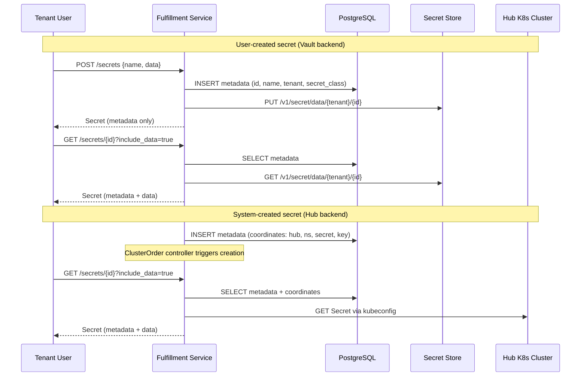

# Secret Management

## Summary

This enhancement introduces a Secret resource backed by pluggable storage
backends — a Vault-compatible secret store for encrypted-at-rest storage
and Hub for on-demand Kubernetes credential retrieval — giving all OSAC
personas a uniform interface for creating, retrieving, and managing
credentials through the fulfillment-service gRPC/REST API and CLI. See
[PRD](prd.md) for detailed requirements.

## Motivation

Credentials in OSAC are currently scattered across resource types.
Cluster kubeconfigs are retrieved via dedicated `GetKubeconfig` and
`GetPassword` RPCs that reach into hub Kubernetes clusters at request time.
Pull secrets, OIDC client secrets, and storage backend passwords are stored
inline in their parent resource's spec, redacted on read and stripped on
update through ad-hoc server-side logic. Each resource type that touches
credentials implements its own storage, redaction, and retrieval pattern.

This fragmentation creates three problems. First, credential data stored in
the PostgreSQL `data` JSONB column is not encrypted at rest — anyone with
database access can read secrets in cleartext. Second, tenants cannot manage
credentials independently: rotating a pull secret requires updating the
cluster that uses it, and there is no way to list all credentials a tenant
owns. Third, each new resource type that needs credentials must reimplement
redaction and retrieval logic, increasing the surface area for mistakes.

This design introduces a dedicated Secret resource with pluggable backends
that centralizes credential storage, enforces encryption at rest, and
provides a single API surface for all credential operations. The existing
Hub credential retrieval logic in `clusters_server.go` is formalized as a
backend, and any Vault-compatible secret store (such as OpenBao or
HashiCorp Vault) provides the encrypted storage backend.

### Goals

- Reuse the existing GenericServer/GenericDAO patterns for Secret CRUD metadata, adding backend dispatch only for data storage and retrieval.
- Follow the established public/private API split: public API exposes backend-agnostic Secret CRUD; private API adds SecretClass management and backend-specific fields.
- Follow the StorageBackend pattern for SecretClass — a DB-backed, admin-only resource with no Kubernetes CRD and no reconciler.
- Maintain tenant isolation guarantees consistent with all other OSAC resources (OPA policies, tenant-scoped metadata, per-tenant backend isolation).
- Keep the Secret data path (store/retrieve bytes) separate from the metadata path (CRUD in PostgreSQL) so that secret bytes never transit PostgreSQL.

### Non-Goals

- Secret rotation automation — users can update secret values manually, but scheduled or event-driven rotation workflows are out of scope.
- UI support — secret management is CLI and API only for 0.2.
- Secret store deployment and operations — the cloud provider is responsible for deploying and operating the Vault-compatible secret store. OSAC connects to it; OSAC does not manage its lifecycle.
- Kubernetes CRD representation for Secrets — Secrets are fulfillment-service resources, not osac-operator CRDs.

## Proposal

Two new resource types are introduced:

**SecretClass** is a platform-scoped, admin-only resource that declares an
available secret storage backend. It follows the StorageBackend pattern: a
DB-backed resource in the private API with no Kubernetes CRD and no
reconciler [Codebase: fulfillment-service/proto/private/osac/private/v1/storage_backend_type.proto].
Each SecretClass defines a backend type (`VAULT` for any Vault-compatible
store, or `HUB` for on-demand Kubernetes retrieval) and the connection
parameters for that backend. Cloud Infrastructure Admins create SecretClass
instances during platform setup after deploying their chosen secret store.

**Secret** is a tenant-scoped resource that holds credential metadata in
PostgreSQL and delegates data storage to the SecretClass backend. Secrets
appear in both the public and private APIs [Locked: D9]. The public API
provides backend-agnostic CRUD — tenants interact with secrets without
knowing which backend stores them. The private API exposes the
`secret_class` reference and backend-specific fields for admin visibility
and system-created secrets.

Secret data bytes never pass through PostgreSQL [Locked: D3]. On Create,
the server writes metadata to PostgreSQL and data bytes to the backend. On
Get, the server reads metadata from PostgreSQL and fetches data from the
backend only when the caller requests it. List responses return metadata
only.

### Workflow Description

#### Cloud Infrastructure Admin: Configure Secret Backends

Starting state: The cloud provider has deployed a Vault-compatible secret
store (e.g., OpenBao or HashiCorp Vault) and made it reachable from the
OSAC hub cluster.

1. The Cloud Infrastructure Admin creates a SecretClass via the private API:
   `POST /api/private/v1/secret_classes` with backend type `VAULT`,
   endpoint URL, and authentication parameters.
2. The fulfillment-service validates the connection by performing a health
   check against the secret store endpoint.
3. The SecretClass is stored in PostgreSQL with state `READY`.
4. The admin optionally creates a Hub SecretClass for on-demand Kubernetes
   credential retrieval (type `HUB`, no additional endpoint configuration
   — the service uses the existing Hub kubeconfig infrastructure).

#### Tenant User: Create and Retrieve a Secret

Starting state: At least one SecretClass with type `VAULT` exists.

1. The tenant user creates a secret via the public API:
   `POST /api/public/v1/secrets` with name, labels, and the secret data
   (opaque bytes).
2. The fulfillment-service selects the default SecretClass (the first
   available Vault-type SecretClass) [Assumption], writes metadata to
   PostgreSQL, and stores the data bytes in the secret store under the
   tenant's KV path.
3. The API returns the Secret with metadata but without data bytes.
4. To retrieve the data, the user calls
   `GET /api/public/v1/secrets/{id}?include_data=true`.
5. The fulfillment-service reads metadata from PostgreSQL, fetches data
   from the secret store, and returns both.
6. To list secrets, the user calls `GET /api/public/v1/secrets` — the
   response contains metadata only, no data bytes.

#### System: Automatic Secret Creation During Cluster Provisioning

Starting state: A cluster has been provisioned and a kubeconfig is
available on the hub.

1. When the ClusterOrder controller detects that the HostedCluster has a
   ready kubeconfig, it calls the fulfillment-service private Secrets API
   to create a Hub-backed secret.
2. The fulfillment-service stores the secret metadata in PostgreSQL with
   the Hub SecretClass reference and the coordinates
   (hub ID, namespace, Kubernetes Secret name, key) needed to retrieve
   the data on demand.
3. The secret is associated with the cluster's tenant and annotated with
   the cluster's owner reference.
4. When a tenant user calls `GET /api/public/v1/secrets/{id}?include_data=true`,
   the fulfillment-service follows the Hub coordinates to retrieve the
   kubeconfig from the hub cluster — the same retrieval path currently
   implemented in `getHostedClusterSecret()` [Codebase: fulfillment-service/internal/servers/clusters_server.go].



The diagram shows the two data paths. User-created secrets flow through
the Vault-compatible secret store: metadata is persisted in PostgreSQL and
data bytes are written to the store's KV engine under a tenant-scoped
path. System-created secrets (Hub backend) store only coordinates in
PostgreSQL; the actual data is fetched on demand from the hub Kubernetes
cluster using the existing Hub kubeconfig infrastructure. In both cases,
the tenant user interacts with the same public API — the backend is
transparent.

#### Error Handling

**Secret creation fails at the backend:** If the secret store write fails
after metadata is committed to PostgreSQL, the server deletes the
PostgreSQL record and returns an error. The operation is not partially
committed.

**Backend unavailable on read:** If the secret store or the Hub cluster is
unreachable when the user requests data, the API returns an error with
status `UNAVAILABLE`. The metadata remains intact — the user can retry.

**SecretClass deleted while secrets reference it:** SecretClass deletion is
blocked by a finalizer while any Secret references it.

### API Extensions

**New gRPC services:**

| Service | API | Purpose |
|---------|-----|---------|
| `osac.private.v1.SecretClasses` | Private | CRUD for secret backend declarations (admin-only) |
| `osac.private.v1.Secrets` | Private | Full Secret CRUD with SecretClass visibility |
| `osac.public.v1.Secrets` | Public | Backend-agnostic Secret CRUD for tenants |

**Modified resources:**

- `osac.private.v1.Event`: Add `Secret secret = 38` and
  `SecretClass secret_class = 39` to the payload oneof.
- `osac.public.v1.Clusters`: `GetKubeconfig` and `GetPassword` RPCs are
  deprecated with a transition period. Both RPCs continue to function but
  return a deprecation warning header. Once secret-based retrieval is
  established, they are removed.

**Finalizers:**

- `secret-class-protection` on SecretClass — prevents deletion while
  secrets reference the SecretClass.

**No CRDs, webhooks, or osac-operator changes are introduced for Secret
or SecretClass.** These are fulfillment-service DB-backed resources, like
StorageBackend and NetworkClass. The ClusterOrder controller in
osac-operator is modified to create Hub-backed secrets via the
fulfillment-service gRPC API after cluster provisioning.

### Implementation Details/Notes/Constraints

#### Proto Schema: SecretClass

```proto
// private/osac/private/v1/secret_class_type.proto

message SecretClass {
  string id = 1;
  Metadata metadata = 2;
  SecretClassSpec spec = 3;
  SecretClassStatus status = 4;
}

message SecretClassSpec {
  SecretClassType type = 1;
  string description = 2;
  SecretClassVaultConfig vault = 3;
}

enum SecretClassType {
  SECRET_CLASS_TYPE_UNSPECIFIED = 0;
  SECRET_CLASS_TYPE_VAULT = 1;
  SECRET_CLASS_TYPE_HUB = 2;
}

message SecretClassVaultConfig {
  string endpoint = 1;
  string auth_mount_path = 2;
  string kv_mount_path = 3;
  string role = 4;
}

message SecretClassStatus {
  SecretClassState state = 1;
  optional string message = 2;
}

enum SecretClassState {
  SECRET_CLASS_STATE_UNSPECIFIED = 0;
  SECRET_CLASS_STATE_READY = 1;
  SECRET_CLASS_STATE_ERROR = 2;
}
```

`SecretClassVaultConfig` holds connection parameters for the
Vault-compatible secret store. `endpoint` is the store's API URL.
`auth_mount_path` is the Kubernetes auth method mount path (e.g.,
`auth/kubernetes`). `kv_mount_path` is the KV v2 mount path (e.g.,
`secret`). `role` is the role that fulfillment-service authenticates as.
This configuration works with any Vault-compatible API — OpenBao,
HashiCorp Vault, or other compatible implementations. The Hub backend
requires no additional configuration — it uses the existing Hub
infrastructure [Codebase: fulfillment-service/internal/servers/clusters_server.go].

#### Proto Schema: Secret

```proto
// private/osac/private/v1/secret_type.proto

message Secret {
  string id = 1;
  Metadata metadata = 2;
  SecretSpec spec = 3;
  SecretStatus status = 4;
}

message SecretSpec {
  string secret_class = 1;
  SecretType type = 2;
  optional bytes data = 3;
  HubCoordinates hub_coordinates = 4;
}

enum SecretType {
  SECRET_TYPE_UNSPECIFIED = 0;
  SECRET_TYPE_OPAQUE = 1;
}

message HubCoordinates {
  string hub = 1;
  string namespace = 2;
  string secret_name = 3;
  string key = 4;
}

message SecretStatus {
  SecretState state = 1;
  optional string message = 2;
}

enum SecretState {
  SECRET_STATE_UNSPECIFIED = 0;
  SECRET_STATE_READY = 1;
  SECRET_STATE_ERROR = 2;
}
```

```proto
// public/osac/public/v1/secret_type.proto

message Secret {
  string id = 1;
  Metadata metadata = 2;
  SecretSpec spec = 3;
  SecretStatus status = 4;
}

message SecretSpec {
  SecretType type = 1;
  optional bytes data = 2;
}

enum SecretType {
  SECRET_TYPE_UNSPECIFIED = 0;
  SECRET_TYPE_OPAQUE = 1;
}

message SecretStatus {
  SecretState state = 1;
  optional string message = 2;
}

enum SecretState {
  SECRET_STATE_UNSPECIFIED = 0;
  SECRET_STATE_READY = 1;
  SECRET_STATE_ERROR = 2;
}
```

The private Secret includes `secret_class` (the SecretClass ID reference)
and `hub_coordinates` (for Hub-backend secrets) [Locked: D9]. The public
Secret omits both — tenants see a backend-agnostic interface. The `data`
field is `optional bytes`: present only when the caller requests it
(`include_data=true` on Get) and never returned in List responses.

The `data` field is write-only in the public API: provided on Create and
Update to set the secret value, returned on Get only with `include_data`,
and never included in List. The server strips `data` from the response
unless explicitly requested.

#### Proto Schema: Service RPCs

Both public and private Secrets services follow the standard CRUD pattern
[Codebase: fulfillment-service/proto/private/osac/private/v1/storage_backends_service.proto]:

```proto
service Secrets {
  rpc List(SecretsListRequest) returns (SecretsListResponse);
  rpc Get(SecretsGetRequest) returns (SecretsGetResponse);
  rpc Create(SecretsCreateRequest) returns (SecretsCreateResponse);
  rpc Update(SecretsUpdateRequest) returns (SecretsUpdateResponse);
  rpc Delete(SecretsDeleteRequest) returns (SecretsDeleteResponse);
}
```

The public `SecretsGetRequest` adds `bool include_data = 2` alongside
the standard `string id = 1`. When false (default), the response omits
`spec.data`. When true, the server fetches data from the backend and
populates the field.

The private Secrets service adds `Signal` (standard GenericServer
requirement, returns UNIMPLEMENTED).

SecretClasses follows the same pattern for private API only.

#### Database Schema

Migration 73 creates the `secrets` and `secret_classes` tables:

```sql
-- 73_create_secret_management_tables.up.sql

create table secret_classes (
  id                  text not null primary key default uuidv7(),
  tenant              text not null default '',
  project             ltree not null default ''::ltree,
  name                text not null default '',
  creator             text not null default '',
  creation_timestamp  timestamp with time zone not null default now(),
  deletion_timestamp  timestamp with time zone not null default 'epoch',
  finalizers          text[] not null default '{}',
  labels              jsonb not null default '{}'::jsonb,
  annotations         jsonb not null default '{}'::jsonb,
  data                jsonb not null default '{}'::jsonb,
  version             integer not null default 0
);

create index secret_classes_name_idx on secret_classes (name);
create index secret_classes_creator_idx on secret_classes (creator);
create index secret_classes_labels_idx on secret_classes using gin (labels);

create trigger check_immutable_columns
  before update on secret_classes
  for each row
  execute function check_immutable_columns('id', 'tenant', 'name');

create table archived_secret_classes (like secret_classes including all);
alter table archived_secret_classes drop constraint archived_secret_classes_pkey;
alter table archived_secret_classes add column archival_timestamp
  timestamp with time zone not null default now();

-- Secrets table
create table secrets (
  id                  text not null primary key default uuidv7(),
  tenant              text not null default '',
  project             ltree not null default ''::ltree,
  name                text not null default '',
  creator             text not null default '',
  creation_timestamp  timestamp with time zone not null default now(),
  deletion_timestamp  timestamp with time zone not null default 'epoch',
  finalizers          text[] not null default '{}',
  labels              jsonb not null default '{}'::jsonb,
  annotations         jsonb not null default '{}'::jsonb,
  data                jsonb not null default '{}'::jsonb,
  version             integer not null default 0
);

alter table secrets add constraint secrets_tenant_fk
  foreign key (tenant) references tenants (name);
alter table secrets add constraint secrets_project_fk
  foreign key (tenant, project) references projects (tenant, name);

create index secrets_name_tenant_idx on secrets (name, tenant);
create index secrets_tenant_idx on secrets (tenant);
create index secrets_creator_idx on secrets (creator);
create index secrets_labels_idx on secrets using gin (labels);

create unique index secrets_unique_name_per_tenant
  on secrets (name, tenant)
  where deletion_timestamp = 'epoch';

create trigger check_immutable_columns
  before update on secrets
  for each row
  execute function check_immutable_columns('id', 'tenant', 'project', 'name');

create table archived_secrets (like secrets including all);
alter table archived_secrets drop constraint archived_secrets_pkey;
alter table archived_secrets add column archival_timestamp
  timestamp with time zone not null default now();
```

SecretClasses are platform-scoped (`tenant = ''`, like StorageBackend), so
they have no tenant FK. Secrets are tenant-scoped with project support,
following the `objects` table pattern [Codebase: fulfillment-service/internal/database/migrations/70_add_objects_table.up.sql].

The `data` JSONB column stores the SecretSpec proto JSON — which includes
`secret_class`, `type`, and `hub_coordinates` but NOT the actual secret
bytes. Secret bytes are stored in the Vault-compatible secret store or
retrieved from Kubernetes.

#### Server Implementation

**PrivateSecretClassesServer** follows the StorageBackend pattern: wraps
`GenericServer[*privatev1.SecretClass]` with validation. Forces
`tenant = auth.SharedTenant` on Create [Codebase: fulfillment-service/internal/servers/private_storage_backends_server.go].
Adds a health check against the secret store endpoint during Create to
verify connectivity before setting state to `READY`.

**PrivateSecretsServer** wraps `GenericServer[*privatev1.Secret]` and adds:

- **Create override:** After GenericServer writes metadata to PostgreSQL,
  dispatches to the backend to store data bytes. If the backend write
  fails, deletes the PostgreSQL record and returns an error. Strips `data`
  from the stored proto (the `data` JSONB column must not contain secret
  bytes). Sets `secret_class` to the default SecretClass if not specified.
- **Get override:** After GenericServer reads from PostgreSQL, checks
  `include_data`. If true, dispatches to the backend to fetch data bytes
  and populates `spec.data` in the response.
- **Update override:** If `spec.data` is present in the update, dispatches
  to the backend to overwrite the stored value. Strips `data` before
  writing the update to PostgreSQL.
- **Delete override:** Before GenericServer deletes from PostgreSQL,
  dispatches to the backend to delete the stored data. For Hub-backend
  secrets, deletion removes only the metadata — the underlying Kubernetes
  Secret is not deleted (it is owned by the HostedCluster).
- **List:** No override needed — GenericServer returns metadata from
  PostgreSQL, and `data` is not stored in the `data` column.
- **RedactFunc:** Strips `spec.data` and `spec.hub_coordinates` from event
  payloads.

**SecretsServer (public)** wraps PrivateSecretsServer with
`GenericMapper` for public↔private type conversion [Codebase: fulfillment-service/internal/servers/clusters_server.go].
The mapper strips `secret_class` and `hub_coordinates` from private→public
conversion. The `include_data` flag is forwarded to the private server.

#### Backend Interface

```go
type SecretBackend interface {
    Store(ctx context.Context, tenant, id string, data []byte) error
    Fetch(ctx context.Context, tenant, id string) ([]byte, error)
    Delete(ctx context.Context, tenant, id string) error
    HealthCheck(ctx context.Context) error
}
```

Two implementations:

**VaultBackend:** Uses the Vault-compatible KV v2 API, working with any
implementation that speaks this protocol (OpenBao, HashiCorp Vault, etc.).
Authenticates via the Kubernetes auth method — the fulfillment-service
ServiceAccount token is exchanged for a token scoped to the tenant's KV
path. Data is stored at `{kv_mount_path}/data/{tenant}/{secret_id}`.
Per-tenant path isolation ensures that even if the token is compromised,
it can only access secrets for the tenant it authenticated for.

**HubBackend:** Reuses the existing `getHostedClusterSecret()` logic
[Codebase: fulfillment-service/internal/servers/clusters_server.go]. Reads
the Hub record from the DAO, creates a Kubernetes client from the Hub
kubeconfig (using the cached client pool), and reads the Secret from the
target namespace. `Store` returns an error — Hub secrets are created by
Kubernetes controllers, not by the fulfillment-service. `Delete` is a
no-op.

#### Secret Store Prerequisites

The cloud provider is responsible for deploying and operating a
Vault-compatible secret store. OSAC does not manage the secret store
lifecycle — it connects to the store via the Vault-compatible API using
the parameters configured in the SecretClass.

The secret store must meet these prerequisites before a SecretClass can
be created:

- **Reachable endpoint** — the store's API must be reachable from the
  fulfillment-service pods on the hub cluster
- **TLS** — the endpoint must serve TLS; the CA certificate must be
  trusted by the fulfillment-service (via the cluster's trust bundle or
  a mounted CA secret)
- **Kubernetes auth method** — enabled and configured to trust the
  fulfillment-service ServiceAccount for token exchange
- **KV v2 secret engine** — mounted at the path specified in the
  SecretClass configuration
- **Per-tenant policy support** — the store must allow policy creation
  scoped to tenant KV paths (see Tenant Onboarding below)

Documentation will include a setup guide covering these prerequisites
for common implementations (OpenBao and HashiCorp Vault).

#### Secret Store Tenant Onboarding

When a new tenant is created, the fulfillment-service creates a policy
in the secret store that grants access to
`{kv_mount_path}/data/{tenant_name}/*`. This is done in the tenant
creation flow in the PrivateTenantsServer, similar to how tenant-scoped
resources are initialized today. The fulfillment-service authenticates
to the store using the Kubernetes auth method and issues the policy
creation via the Vault-compatible sys/policy API.

#### Deprecation of GetKubeconfig and GetPassword

Both RPCs remain functional during the transition period [Locked: D8]. The
implementation adds a `grpc-status-details-bin` trailer with a deprecation
notice directing users to the Secrets API. The CLI `get kubeconfig` and
`get password` commands print a deprecation warning to stderr.

Once secret-based retrieval is established and documented:
1. The RPCs are removed from the proto definitions.
2. The CLI commands are removed.
3. The `getHostedClusterSecret()` logic moves fully into the HubBackend
   implementation.

#### CLI Commands

New commands follow existing patterns [Codebase: fulfillment-service/internal/cmd/cli/]:

| Command | Description |
|---------|-------------|
| `osac create secret` | Create a secret from literal value or file |
| `osac get secrets` | List secrets (metadata only) |
| `osac get secret <id>` | Get secret metadata |
| `osac get secret <id> --output-data` | Get secret with data (writes bytes to stdout) |
| `osac describe secret <id>` | Detailed secret metadata view |
| `osac delete secret <id>` | Delete a secret |
| `osac update secret <id>` | Update secret data from literal or file |

The `create secret` command accepts `--from-file <path>` and
`--from-literal <value>` flags, following the kubectl pattern for secret
creation. The `--output-data` flag on `get` replaces the `include_data`
query parameter in the CLI context.

### Security Considerations

**Encryption at rest:** Secret bytes are stored in the Vault-compatible
secret store, which provides encryption at rest via its storage backend.
PostgreSQL stores only metadata (name, tenant, type, references) — no
secret bytes transit the database.

**Authentication to the secret store:** The fulfillment-service
authenticates via the Kubernetes auth method. The ServiceAccount token is
exchanged for a short-lived token scoped to the requested tenant's KV
path. No long-lived tokens are stored.

**Input validation:** Secret data size is capped at 1 MiB (the Vault API
default max request size). Secret names follow the existing OSAC naming
validation (alphanumeric, hyphens, max 253 characters).

**Data exposure in transit:** Secret data is transmitted over TLS-encrypted
gRPC connections. The `include_data=true` parameter is an explicit opt-in
— accidental data exposure through List or default Get responses is not
possible.

**No secret data in logs or events:** The RedactFunc strips `spec.data`
from all event payloads. Server-side logging does not include secret data.

### Failure Handling and Recovery

**Secret store unavailable during secret creation:** The server writes
metadata to PostgreSQL first, then writes data to the secret store. If the
store write fails, the server deletes the PostgreSQL record and returns
`UNAVAILABLE` to the caller. No partial state persists.

**Secret store unavailable during secret read:** The server returns
metadata successfully. If `include_data=true` and the backend is
unreachable, the server returns `UNAVAILABLE`. The user can retry —
metadata is not affected.

**Secret store unavailable during secret deletion:** The server attempts
to delete from the secret store first, then deletes from PostgreSQL. If
the store delete fails, the server returns `UNAVAILABLE` and the secret
remains intact. This prevents orphaned data in the store.

**Hub cluster unreachable:** Hub-backend Get requests return `UNAVAILABLE`
when the hub Kubernetes cluster is unreachable. This is the same behavior
as the current `GetKubeconfig` RPC.

**SecretClass backend goes offline:** Existing secrets with that
SecretClass remain in PostgreSQL with metadata intact. Get requests with
`include_data=true` return `UNAVAILABLE`. The SecretClass state transitions
to `ERROR` if health checks fail.

**Fulfillment-service restart:** No special recovery needed. GenericServer
and GenericDAO handle database reconnection. Secret store and Hub client
connections are re-established on demand.

### RBAC / Tenancy

**Tenant isolation metadata:** Secrets include
`osac.openshift.io/tenant` and `osac.openshift.io/owner-reference`
annotations, enforced by the existing GenericServer tenancy logic
[Codebase: fulfillment-service/internal/servers/generic_server.go].

**OPA policy additions:**

```rego
# Public API — tenant users and tenant admins
has_client_permissions {
    grpc_method in {
        "/osac.public.v1.Secrets/List",
        "/osac.public.v1.Secrets/Get",
        "/osac.public.v1.Secrets/Create",
        "/osac.public.v1.Secrets/Update",
        "/osac.public.v1.Secrets/Delete",
    }
}

# Private API — admin only (SecretClasses)
is_admin {
    grpc_method in {
        "/osac.private.v1.SecretClasses/List",
        "/osac.private.v1.SecretClasses/Get",
        "/osac.private.v1.SecretClasses/Create",
        "/osac.private.v1.SecretClasses/Update",
        "/osac.private.v1.SecretClasses/Delete",
    }
}
```

**Visibility:** Tenants see only their own secrets. SecretClasses are
platform-scoped and visible only to admins. The public Secret API does
not expose which SecretClass backs a secret [Locked: D9].

**Secret store tenant isolation:** Per-tenant KV paths
(`{kv_mount_path}/data/{tenant_name}/*`) with per-tenant policies in the
secret store ensure backend-level isolation. The fulfillment-service
authenticates with a token scoped to the specific tenant for each
operation.

### Observability and Monitoring

**Prometheus metrics:**

| Metric | Type | Labels | Description |
|--------|------|--------|-------------|
| `osac_secret_backend_request_duration_seconds` | Histogram | `backend`, `operation`, `status` | Latency of backend operations (store/fetch/delete) |
| `osac_secret_backend_errors_total` | Counter | `backend`, `operation` | Backend operation failures |
| `osac_secrets_total` | Gauge | `tenant`, `secret_class` | Total secrets per tenant and backend |

**Threshold alerts:** `osac_secret_backend_errors_total` rate > 0 over 5
minutes indicates a backend connectivity issue. `osac_secret_backend_request_duration_seconds`
p99 > 5s indicates backend performance degradation.

**Kubernetes events:** None — Secrets are not CRDs.

**Structured logging:** Backend operations log at INFO level with
tenant and secret ID (not data). Errors log at ERROR with the backend
error message.

### Risks and Mitigations

| Risk | Impact | Mitigation |
|------|--------|------------|
| Secret store becomes a single point of failure for all secret operations | Secret creation and data retrieval fail when the store is down | Vault-compatible stores support HA deployment (e.g., Raft consensus). The cloud provider is responsible for HA configuration. Metadata remains accessible when the store is down. |
| Secret store data loss results in unrecoverable secret loss | Secrets with Vault backend become permanently inaccessible | The cloud provider is responsible for backup and disaster recovery of their secret store deployment. Documentation will cover backup recommendations. |
| Per-tenant policy management does not scale | Tenant creation becomes slow as policy count grows | Policy templating — a single parameterized policy template covers all tenants. Only the policy binding (role) is per-tenant. |
| Transition period creates two paths for credential retrieval | Users confused about whether to use GetKubeconfig or Secrets API | Document the deprecation timeline. CLI commands print deprecation warnings. GetKubeconfig/GetPassword remain functional until removal. |

### Drawbacks

Requiring cloud providers to deploy and operate a Vault-compatible secret
store adds an external prerequisite to the platform. Cloud providers must
deploy, configure, monitor, and back up an additional stateful service.
This is justified because storing credentials encrypted at rest is a
baseline security requirement that cannot be met with PostgreSQL alone —
the alternative is building custom encryption within the
fulfillment-service, which would duplicate functionality that
Vault-compatible stores already provide.

The two-backend model (Vault + Hub) adds complexity to the server
implementation. Each CRUD operation must dispatch to the correct backend,
and failure handling differs between backends. This complexity is
contained within the Secret server implementation and is hidden from
the API surface — tenants interact with a uniform interface regardless
of backend.

## Alternatives (Not Implemented)

### Database Envelope Encryption

Store secret data in PostgreSQL, encrypted using envelope encryption
(RSA wrapping an AES data key). This avoids the external secret store
dependency and keeps all data in one store.

**Rejected because:** Key management for envelope encryption is complex —
the wrapping key must itself be securely stored and rotated. This
effectively requires a KMS, circling back to the same external dependency
problem. Vault-compatible stores provide a battle-tested implementation
of this pattern [Locked: D1].

### Single Vault Backend (No Hub)

Remove the Hub backend and store all credentials in the Vault-compatible
store, including cluster kubeconfigs that are currently in Kubernetes.

**Rejected because:** Hub credentials (kubeconfigs, admin passwords) are
generated and managed by the HostedCluster controller in Kubernetes.
Copying them to an external store would create synchronization problems —
the canonical source remains Kubernetes, and the on-demand retrieval
pattern avoids stale copies [Locked: D2].

### Kubernetes CRD for Secrets

Represent Secrets as Kubernetes custom resources managed by the
osac-operator, following the pattern used for VirtualNetwork, Subnet,
and other resources.

**Rejected because:** Storing credential data in Kubernetes etcd does not
solve the encryption-at-rest problem without additional etcd encryption
configuration. The fulfillment-service DB-backed pattern (like
StorageBackend) is simpler and avoids round-tripping through the
Kubernetes API for CRUD operations. Secrets have no reconciliation
lifecycle — they are a data store, not a controller-managed resource.

## Open Questions

### 1. Default SecretClass Selection

When a tenant creates a secret without specifying a SecretClass (via the
public API, which does not expose SecretClass), how is the backend
selected?

**Proposed:** Use the first available SecretClass with type `VAULT` and
state `READY`. If multiple exist, use the one with the earliest creation
timestamp. If none exist, return `FAILED_PRECONDITION`.

**Owner:** Design reviewer
**Impact:** Affects Create flow and error handling.

### 2. Secret Size Limits

The 1 MiB limit matches the Vault API default. Should OSAC impose a lower
limit for tenant-created secrets to prevent abuse, while allowing
system-created secrets (kubeconfigs) up to 1 MiB?

**Owner:** Design reviewer
**Impact:** Affects input validation and Create flow.

## Test Plan

**Unit tests (Ginkgo):**
- SecretClass and Secret proto validation (required fields, name format, data size limits)
- Backend interface: mock Vault and Hub backends to test Store/Fetch/Delete dispatch
- Server logic: Create with backend write, Get with/without include_data, Update with data replacement, Delete with backend cleanup
- Public↔private type mapping: verify SecretClass and hub_coordinates are stripped in public responses
- RedactFunc: verify data is stripped from event payloads
- OPA policy: verify role-based access for Secret and SecretClass methods

**Integration tests (Kind cluster):**
- End-to-end Secret CRUD through gRPC with a Vault-compatible store in the Kind cluster
- SecretClass lifecycle: create, health check, delete with and without referencing secrets
- Tenant isolation: verify tenant A cannot read tenant B's secrets
- Hub-backend secrets: create via private API with coordinates, retrieve via public API
- Deprecation: verify GetKubeconfig and GetPassword still function with warning headers

**E2E tests (pytest, osac-test-infra):**
- Secret CRUD via public API (create from literal, create from file, list, get, get with data, update, delete)
- Automatic secret creation during cluster provisioning
- Tenant isolation across secret operations
- CLI commands for secret management

## Graduation Criteria

Graduation criteria will be defined when targeting a release. Expected
stages: Dev Preview → Tech Preview → GA based on production deployment
feedback.

**Dev Preview (0.2):** Full Secret and SecretClass CRUD, Vault and Hub
backends, CLI commands, deprecation warnings on GetKubeconfig/GetPassword.

## Upgrade / Downgrade Strategy

This is a new API with no upgrade impact. Downgrade requires:
1. Migrating any secrets stored in the secret store back to inline resource fields
2. Re-enabling GetKubeconfig/GetPassword RPCs if they were removed
3. Deleting all Secret and SecretClass records from PostgreSQL
4. Running the down migration to drop the `secrets` and `secret_classes` tables

OSAC does not currently support automated upgrades, so data migration and
backward compatibility automation are not concerns at this stage.

## Version Skew Strategy

The Secret API is entirely within the fulfillment-service — there is no
CRD in osac-operator, so there is no version skew between fulfillment-service
and osac-operator for the Secret resource itself.

The ClusterOrder controller modification (creating Hub-backed secrets after
provisioning) introduces a dependency: the osac-operator must use a
fulfillment-service version that includes the Secrets API. If the
fulfillment-service is older, the controller's Secret creation call returns
`UNIMPLEMENTED` and the controller logs a warning without failing
reconciliation. Cluster provisioning continues to work — kubeconfigs remain
accessible via the legacy GetKubeconfig RPC.

## Support Procedures

**Detecting failures:**
- `osac_secret_backend_errors_total` counter increasing indicates backend connectivity issues
- `osac_secret_backend_request_duration_seconds` p99 > 5s indicates degraded backend performance
- Fulfillment-service logs at ERROR level for backend operation failures, including the backend type, tenant, and error message

**Disabling the feature:**
- Delete all SecretClass instances to prevent new secret creation
- Existing secrets remain in PostgreSQL (metadata) and the secret store (data) but cannot be created or updated
- Secret Get/List operations for metadata continue to work
- Get with `include_data=true` returns `UNAVAILABLE` if the SecretClass is deleted
- No impact on cluster health or existing workloads — legacy GetKubeconfig/GetPassword RPCs remain available during the transition period

**Re-enabling:**
- Recreate the SecretClass instances
- Secret operations resume immediately — no data loss or consistency issues

## Infrastructure Needed

- Vault-compatible secret store instance in the integration test Kind cluster (OpenBao recommended for CI due to its permissive license)
